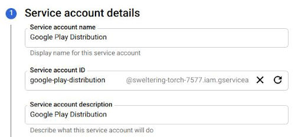
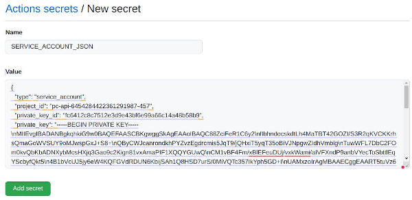
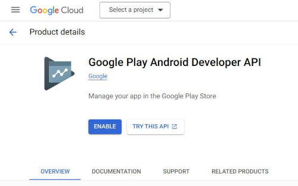
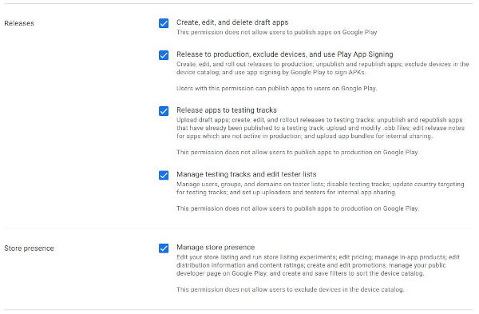

Google Play Store Distribution Setup
====================================

To upload to Google Play, we are using [this](https://github.com/r0adkll/upload-google-play) script. Here are quick setup steps you should take to make everything work buttery smooth:

1. Change the package name inside the script, to match your app.
2. Check that you have `whatsnew` folder in your root dir. You can change the name of this folder in the script under the value `whatsNewDirectory`.
3. Create or update changelog files inside the folder. The name of the file should match the pattern `whatsnew-en-US`, where you can specify the language and region. Text placed inside the file will be used as a changelog for the version once it is uploaded to Play Store.
4. You will need to create a new Service Account and put it as a Secret to your Github settings. To do this, follow the [Setup Service Account](#setup_service_account_anchor) section.
5. As a last step, you need to [Setup Google Play Store](#setup_google_play_store_anchor) API Access.

Before you can use this Github Action to automatically build the app and upload it to Play Store, you still need to bundle the first version yourself and upload the first version to the store manually.

Now, you should be able to make your first automatic release to the play store. To do this, you just need to create and push the correct tag on commit. By default, the script uses the following format to start the action: **"vX.X.X-release"**, where the **X.X.X** is the app version.

## Setup Service Account
First access the Google Cloud Console service account section. Here is a quick [link](https://console.cloud.google.com/iam-admin/serviceaccounts). You will need to create a new Service Account here. I would recommend naming it something like "Google Play Distribution".

After hitting **"Create and continue"**, you want to give this Service Account **"Editor"** access. So do not forget to set it.

Once the Service Account is created, you want to generate a new key. You can do so under the **"Key"** section when you are inside the service account detail. Here, just hit the **"Add Key"** button, select **"Create new Key"**, and make sure that you have JSON selected before clicking **"Create"**. JSON file with the key should be downloaded automatically. We now need to copy the content of this file and set it as a new Github Secret under Github **Settings -> Secrets -> New Secret**. As a name, we want to use **"GOOGLE_PLAY_DISTRIBUTION_SERVICE_ACCOUNT_JSON"**. In case we want to put a different name, we need to change it inside the Github Action config file. It should look like the following. Once done, hit the **"Add secret"** button.

## Setup Google Play Store

### Enable Google Play Android developer API
First, you want to enable **Google Play Android Developer API**. You can also find it inside the Google Cloud Platform, under APIs & Services, or by simply clicking [here](https://console.cloud.google.com/apis/library/androidpublisher.googleapis.com). Make sure you have the correct project selected at the top of the page.

### Invite Service account
Go to [Google Play Console](https://play.google.com/console), select your account and a correct project, and visit tab **"Users and permissions"**. Here you need to click on "Invite new users".

As an email address, use the copied Service Account email. Fill in correct permissions under the **"Account permissions"** Tab. The last step is to hit the **"Invite user"** button at the bottom right corner.

