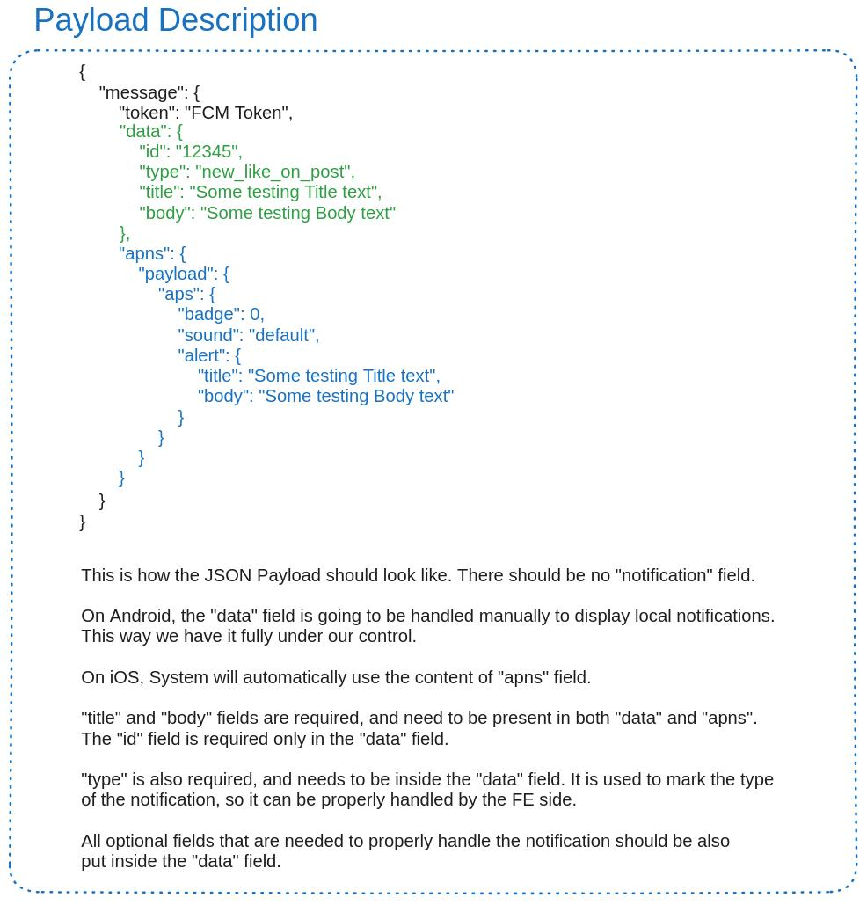
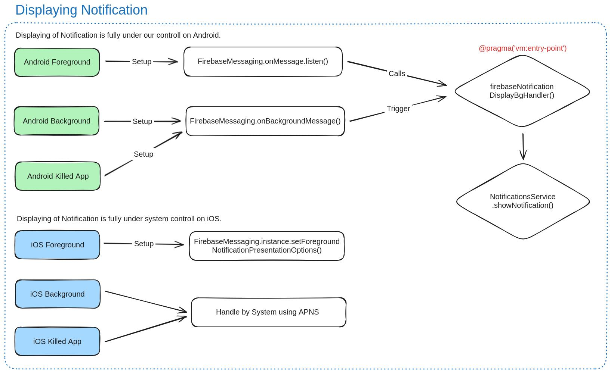
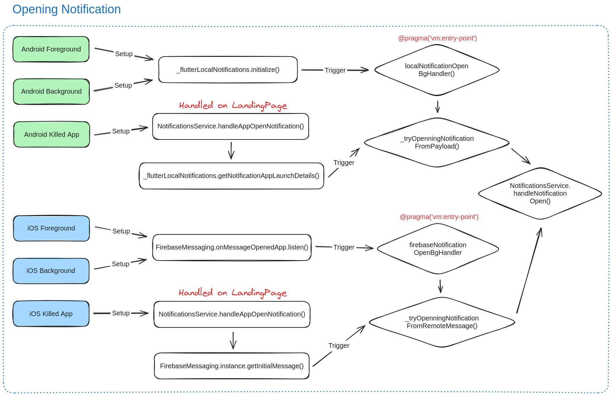
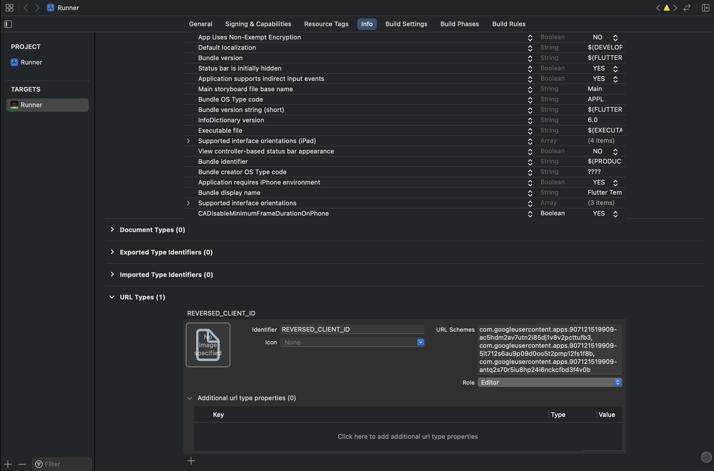

# Flutter Template
- [Project notes](#project-notes)

- [Our values](#our-values)

- [First steps](#first-steps)

- [Project](#project)
    - [Project structure](#project-structure)
    - [Supported platforms](#supported-platforms)
    - [Project run](#project-run)
        - [Linux](#linux)
    - [Flavors](#flavors)

- [Build and Distribution](#build-and-distribution)
    - [Assembling the App](#assembling-the-app)
    - [Deploying the app](#deploying-the-app)
        - [Android](#android)
            - [Manual](#manual)
            - [Firebase App Distribution using GitHub Actions](#firebase-app-distribution-using-github-actions)
            - [Google Play Distribution using GitHub Actions](#google-play-distribution-using-github-actions)
        - [iOS](#ios)
        - [Web](#web)
    - [Versioning](#versioning)

- [Implementation details](#implementation-details)
    - [Architecture](#architecture)
    - [Push Notifications](#push-notifications)
    - [GIT](#git)
    - [GitHub Actions](#github-actions)
    - [Theming](#theming)
    - [Social Logins](#social-logins)
        - [Apple on Android](#apple-on-android)
        - [Google on iOS](#google-on-ios)

- [Testing](#testing)
    - [Widgets Tests](#widget-tests)
    - [Integration Tests](#integration-tests)

- [Tooling](#tooling)
    - [FVM](#fvm)
    - [Application Rebranding](./project_setup/README.md#application-rebranding)
    - [Icons generation](./project_setup/README.md#app-icon-generation)
    - [Splash screen generation](./project_setup/README.md#splash-screen-generation)
    - [Precompiling shaders](#precompiling-shaders)

- [Services](#services)
    - [Firebase setup](#firebase-setup)
    - [Firebase hosting setup](#firebase-hosting-setup)

- [Security](#security)
    - [freeRASP](#freerasp)

- [TODOs](#todos)

- [Authors](#authors)


<!-- ################################################## -->
<!-- #######           Project Notes            ####### -->
<!-- ################################################## -->
# Project notes

- Notes that could be beneficial to know during the development. 
- For example list of test accounts, required credentials, steps required to get testing account, etc.
<!-- ################################################## -->


<!-- ################################################## -->
<!-- #########           Our values            ######## -->
<!-- ################################################## -->
# Our values

These are our four core values:
- **User-Centric Approach** - Nothing is more important than our users. Keep the end-users in mind throughout the development process. Empathize with users' needs and pain points, and design Flutter applications that provide a great user experience. Regularly seek feedback and iterate based on user input.
- **Quality Focus** - We should prioritize delivering high-quality code by adhering to best coding practices, following Flutter guidelines, and performing thorough testing when possible.
- **Accountability** - We support responsibility and accountability among team members. Encourage individuals to take ownership of their tasks and deliverables, meet deadlines, and communicate effectively about progress and challenges.
- **Innovation** - We encourage creativity and innovation within the Flutter team. Support an environment where team members feel comfortable suggesting new ideas, experimenting with different approaches, and finding new solutions to problems.
<!-- ################################################## -->


<!-- ################################################## -->
<!-- ########           First steps            ######## -->
<!-- ################################################## -->
# First steps

1. - [ ] Create a new repo from this template.
2. - [ ] Set up the GIT settings according to your team's needs.
3. - [ ] Clone created repository and open it trough File -> Open Workspace from File... -> `flutter.code-workspace`. Open.../Open folder... won't work ⚠️
3. - [ ] Remove any unused platforms (Android, ios, web, Windows, Linux (+snap), macOS)
    - Remove them from the folder structure of the template.
    - Remove them from the `AppPlatform` class.
    - When removing the `Web` platform, remove also `firebase.json` and `.firebaserc`, `web_setup.dart`, `flutter_web_plugins` and `universal_html` from the `pubspec.yaml` file.
    - When removing all Desktop platforms, `window_manager` should be safe to remove from `pubspec.yaml` file.
    - Fix all the reported issues that the change caused.
4. - [ ] Update `.github/CODEOWNERS` file.
5. - [ ] Change the package and application name. This process is described in the [Application Rebranding](#application-rebranding) section.
6. - [ ] Change the app icon. This process is described in the [Icons generation](./project_setup/README.md#app-icon-generation) section.
7. - [ ] Change the app splash screen. This process is described in the [Splash screen generation](./project_setup/README.md#splash-screen-generation) section.
8. - [ ] Set up Firebase or remove it completely. This process is described in the [Firebase setup](#firebase-setup) section.
9. - [ ] Go through all the ToDo's inside the project, and react to them.
<!-- ################################################## -->


<!-- ################################################## -->
<!-- ##########           Project            ########## -->
<!-- ################################################## -->
# Project

## Project structure
- Our ideology is to combine feature and layer based architecture. Here is a short description of our folder structure you should follow.
```
‣ lib
  ‣ app -> Application class + Setup of Application class
    ‣ configuration -> Config files for different flavors
    ‣ navigation -> Setup of the App Navigation structure
    ‣ setup -> Classes to wrap up the Application setup
    ‣ theme -> Setup of the App theme
  ‣ assets -> Folder for generated assets code
  ‣ common -> Should contain code that is shared between features, and is closely bound to the state and UI of the app
    ‣ animation -> Animations used in features
    ‣ component -> Shared individual Widgets, like custom_app_bar
    ‣ composition -> Shared larger Widgets builds from smaller ones, like bottom sheet
    ‣ data
      ‣ dbo -> Classes to transfer data over to the database 
      ‣ dto -> Classes to transfer data over the network
      ‣ enum -> Enum classes used across the App
      ‣ entity -> Entity classes used across the App
    ‣ extensions -> Extension classes/methods over existing data types
    ‣ provider -> Global Services and manager providers, like Notification Service
    ‣ usecase -> Methods used to get/post data. Usually from/to network or local database
    ‣ validator -> Classes for text input validation
  ‣ core -> Should contain code that usually wraps some kind of outside service
    ‣ analytics -> Wrapper code for Analytics
    ‣ database -> Wrapper code for Local Storage layer
    ‣ network -> Wrapper code for the Network layer
    ‣ riverpod -> Riverpod related classes for easier state handling
  ‣ features -> Contains separate features
```
<!-- ################################################## -->

## Supported platforms
- Mobile (Android, iOS)
- Web
- Desktop (MacOS, Linux, Windows)
<!-- ################################################## -->

## Project run
1. Run `flutter pub get`.
2. Run `make install` to setup all project dependencies.
3. Run `make gen` to generate files.
4. Open the project in your favorite IDE and code 🎉.

When you don't see generated files inside the project, first try to run `make gen`.

You can run following command in your terminal to constantly watch for any code-generation changes, and rebuilding the `.g.dart` files automatically.
```
flutter pub run build_runner watch --delete-conflicting-outputs
```

as an alternative you can just use:
```
make watch
```

### Linux
I personally had small issues getting the app run on Linux. I was missing `libstdc++-12-dev` installed.
Another problem was the App name inside `CMakeLists.txt`. It must not contain spaces.
<!-- ################################################## -->

## Flavors
There are 3 environments (Development, Staging, and Production) with 3 Flutter modes, which makes a total of 9 configurations. 

You can read about flavors setup in the following tutorials:
- 📱 [Android and iOS](https://docs.flutter.dev/deployment/flavors#launching-your-app-flavors)
- 🌐 There are various ways how to support web configuration but for now, we don't need any.
    - Copying files like scripts and `index.html` from different folder to web folder.
    - Making class, where we can use `dart:html` and access dom at runtime.
- 🖥️ [MacOS](https://docs.flutter.dev/deployment/macos) - Is not ready, but there is [merged PR](https://github.com/flutter/flutter/pull/119564) to master flutter branch, so hopefully, we will get support for flavors on macOS soon. If you want to test the app on macOS, you have to remove arguments from the `launch.json` configuration.
- 🖥️ [Windows](https://docs.flutter.dev/deployment/windows) - Flavors are not supported yet.
- 🖥️ [Linux](https://docs.flutter.dev/deployment/linux) - Flavors are not supported yet.

In case of using firebase with multiple flavors, you have to:
- For iOS, add the custom Build Run Script phase and copy the appropriate `GoogleService-Info.plist` file. The script is already prepared; simply uncomment it and add the necessary `plist` files to their destinations.

For Google sign in:
- for iOS, you have to copy value from `REVERSED_CLIENT_ID` from `GoogleService-Info.plist` into `GOOGLE_REVERSED_CLIENT_ID` in build settings.
<!-- ################################################## -->


<!-- ################################################## -->
<!-- ##########    Build and Distribution    ########## -->
<!-- ################################################## -->
# Build and Distribution
## Assembling the App
- As we are using flavors, we have to specify which flavor to build using `--flavor` argument, and also select a correct main file using `-t` argument.
- One of the arguments you should use is `--obfuscate`. This makes reverse engineering harder. This has to be used also with `--split-debug-info` which should make the app smaller, and also specify the directory where the mapping file to read obfuscated stack trace is stored.
- Optional step is to include precompiled Shaders. To do that you have to first [Precompile Shaders](#precompiling-shaders) and add `--bundle-sksl-path` argument.
- To build a debug version of the app, include the `--debug` flag.

Here is an example of assembling an Android app bundle using all the commands:
```
flutter build appbundle \
    -t lib/main_production.dart --flavor production \
    --obfuscate --split-debug-info=build/app/outputs/symbols \
    --bundle-sksl-path flutter_01.sksl.json \
    --debug
```
<!-- ################################################## -->

## Deploying the app
### Android
#### Manual
To deploy the app manually, you have to:
1. Make sure you have your keystore configured and set up correctly. Check the [Keystore Readme](./android/extras/keystore/README.md)
2. In the terminal run `flutter build appbundle -t lib/main_production.dart --flavor production --obfuscate --split-debug-info=build/app/outputs/symbols` for production release.
3. After creating an app bundle, the mapping file will be included automatically, but the native symbols has to be added manually - it can be found in `build\app\intermediates\merged_native_libs\productionRelease\out`.
   Grab those generated folders, zip them and upload into Google Play console under the new build.
   
#### Firebase App Distribution using GitHub Actions
Android app deployment can be done automatically when adding a tag to GitHub. The tag requirement is listed in `.github\workflows\android_firebase_app_distribution_develop.yml` or `production`. There is still some small setup needed for it to work.

First, you need to create a new Service Account inside the Google Cloud console. Create the service account with a `Firebase App Distribution Admin` role. Then you need to generate new key for it. This key NEEDS to be converted to Base64. You can covert is using following command:
```
base64 -i input.json > output.json.b64
```

Now you need to set the Base64 string as a secret inside your GitHub. You should name it something like `FIREBASE_DEV_CREDENTIAL_FILE_CONTENT` and check that it has the same name inside the script. Also, do not forget to uncomment `apply plugin: 'com.google.gms.google-services'` at the end of the build.gradle file inside the Android app folder.

Now you can use one of the actions we have. There should be at least two actions to build for the develop and for the production environment. You can launch those two by creating a tag on a commit with the name `*-develop` or `*-production`.

As an alternative, you can use `*-firebase-all` which will deploy both at the same time.

#### Google Play Distribution using GitHub Actions
We also have a GitHub Action script for deploying to Google Play automatically. The tag requirement is listed in `.github\workflows\android_play_store_distribution.yml`.

Steps on how to set up this GitHub action properly can be found in a separate [README.md](./.github/workflows/README.md) inside the workflows folder.

#### Obfuscation
If an APK file is released (probably due to using Firebase App Distribution) a mapping file for obfuscation won't be included. To avoid obfuscation for crashlytics simply remove `--obfuscate` from the build command. 
Then the APK can be manually uploaded to Firebase and crashes will be readable. Do not remove it when releasing the app bundle via Google Play.
Another workaround would be uploading the mapping file you can get using `--split-debug-info`. To upload the file, you can use the following command:
```
firebase crashlytics:symbols:upload --app=APP_ID build/app/outputs/symbols
```
APP_ID can be found in the Firebase console.
<!-- ################################################## -->

### iOS
There is some basic setup needed before you are able to build IPA and continue with manual app distribution. First of all, open `Runner.xcworkspace` in `./ios` folder, and click on Runner. There you need to "Signing & Capabilities" tab. Here you have to check "Automatically manage signing" and select correct "Team" for both `Release-staging` and `Release-production` targets. For this you have to be added to the Team in App Store Connect and have the Certificates permissions.

To deploy the app, you have to:
1. In the terminal (never in XCode) run `flutter build ipa -t lib/main_production.dart --flavor production --obfuscate --split-debug-info=build/app/outputs/symbols` for production release (or use makefile command `generateIosProductionIpa`).
2. Open generated `./build/ios/ipa` folder and drag builded IPA file to `Transporter` application downloaded from AppStore. Wait for the upload and process to complete, and hit the `Deliver` button.
3. Go to `./build/ios/archive` open the archive using finder, and go to `XXX` folder. Select all dSYM files, and compress them into single .zip file. Drag this .zip file to Firebase Crashlytics.
4. After the build is validated, submit it to review by adding an external tester group.
<!-- ################################################## -->

### Web
To deploy the app, you have to:
1. In the terminal run `make generateWebProduction` to build the web. Make sure you are using `canvaskit`` as a web-rendered. This fixes some rendering issues with fonts, etc. on mobile devices.
2. In the terminal run `make deployWeb` to upload it to the currently set up firebase Web Hosting. More on the Firebase Hosting setup [here](#firebase-hosting-setup).
<!-- ################################################## -->

## Versioning
For now, the app versioning is done manually in the `pubspec.yaml` file where you have to update the `version` property. It is a good practice to also keep comments with the split build number so it is easier to read. For example:
```
version: 1.2.3+10203000 #1 02 03 000
```
<!-- ################################################## -->


<!-- ################################################## -->
<!-- ##########    Implementation Details    ########## -->
<!-- ################################################## -->
# Implementation Details

## Architecture
### Tech stack
Here are the list of libraries we are using for core functionality of our apps:
- Riverpod (DI, State Management)
- AutoRoute (Navigation)
- Dio (Networking)
- Firebase (Push notifications, Remote Config, Crashlytics, Analytics)
- SharedPreferences (Local storage)
- Freezed (Immutable data classes, sealed classes support)
- ExtendedImage, FlutterSvg (displaying of local and network images)
- FreeRasp (Basic security)
- FlutterGen (Assets and localization handling)
- Logger (Debuggable output logging)
- Patrol (App testing)

### Architecture ideology
Note: We will describe our architecture ideology on a sample feature that would be called `user_detail`. Screen, that displays information about any user of the app.

The basic idea behind our architecture is that there should be one feature folder per application screen. In an ideal world, each feature should contain UI split into two files. The first file would be called for example `user_detail_page.dart`. This should be a wrapper around `user_detail_page_content.dart`, and should just wrap the content inside Scaffold. The rest should be implemented inside `content` file. The main idea behind this is the screen UI reusability. In some places, we may need to just use the whole screen content, without its AppBar for example. In some other places, on the other hand, we may need to open it as a standalone feature. 

We covered the UI part, now we need to focus more on the app state and business handling logic. For this, we are using the Riverpod library. Each feature should contain a file ending with `_state.dart`. For example `user_detail_state.dart`. This file should then contain two classes. The first class is a `Freezed` class, which defines the state of the screen. It should hold all the data and state for the feature. As for the naming, the class name should end with the word `State`. For example `UserDetailState`.
The second class is `StateNotifier` class, annotated with `@riverpod` annotation. Rather than splitting the logic completely into small chunks, we believe that it is a good practice to usually have just one `StateNotifier`, providing the `State` for the feature. Naming should follow the same rules as the State class. For example: `UserDetailStateNotifier`. This class must override the `build` method. The State is built inside this method. This is a good place to for example call any necessary API calls, to get data, make some init logic for the feature, etc.. This class can also contain additional methods, to manipulate the State. For example method `updateUser` will update the state with `isUpdatingUser` to `true`, then update the user on the BE side and update the state again with progress set to `false``, and providing new user data. 
Even through we have just a single huge StateHandler, it is possible to observe just specific fields that are needed for building the UI. This way we can optimize the redrawing of the app when the state changes.

The last part is the solution, on how to communicate one-time events from `StateNotifier` back to the UI. For this, we are using a custom implementation of `EventNotifier` which extends `StateNotifier`. This part is implemented inside `*_event.dart` file. For example: `user_detail_event.dart`. Inside we can find the `Freezed` class defining the events (for example `error` event, `userUpdated` event). There is also a definition of an autodispose StateNotifierProvider, named by the feature. For example: `userDetailEventNotifierProvider`. We should then listen to all these defined events using `ref.listen()` inside our `*_page.dart` widget build method. 
<!-- ################################################## -->

## Push Notifications
To correctly display push notifications on both Android and iOS, we need to first receive the correct FCM payload. The sample payload can be seen in the image below. The main idea is that the payload should not contain any `notification` field, so we can use the `data` field, and handle displaying notifications on Android manually.

On the iOS side, on the other hand, the notification will be always displayed by the system. For this, we need to send the `apns` field. The payload handling logic is also described in the image below.



As for the handling of notifications of different types, we introduced `NotificationPayloadEntity`, and `NotificationType`. These both define all the notifications types expected from BE, which the app will be able to handle. All the rest of the logic is handled inside `FirebaseMessagingService` and `NotificationsService` files.




<!-- ################################################## -->

## GIT
We have three main branches. `develop`, `staging`, and `master`. The most important and main branch for us would be `develop`. All pull requests are getting merged there. Once the new version is ready to go out, we merge `develop` into the `staging` branch. Once the app is ready to go to production, we merge `staging` into the `master` branch.

We also have a strict naming convention for branches, commit names, and PR names. Jira ticket is used only when there is any. We are using underscores, except in the Jira ticket name so the Jira automation works well.
For Branches: `{GithubUsername}/{chore/feat/fix/refactor}/{JiraTicketNumber}/{SomeBranchDetails}`
Example: `helu/feat/MN-1726/sign_up`

For Commit and PR names: `{chore/feat/fix/refactor}: {Description}`
Example: `feat: Sign up logic implementation`

When making staging or production releases, you should also always create an appropriate tag on the commit merged to the `master` or `staging` branch. The tag always starts with the letter `v` followed by the version, and optionally by `-staging` flag.
```
Example tag on the master branch: v1.2.3
Example tag on the staging branch: v1.2.3-staging
```
<!-- ################################################## -->

## GitHub Actions
We are using GitHub actions mainly for checking the code style, and for deploying the app.
All GitHub action scripts can be found in the `.github/workflows/` folder.

To make sure we use consistent formatting and that the app is buildable, we run the following commands on each pull request:
- `flutter analyze`
- `flutter build apk`
This way we are ensuring that at least the Android version is buildable. We are also building only debug version of the app as the build is faster.
<!-- ################################################## -->

## Theming
Theming is done inside `lib/core/themes/app_theme.dart`. Currently, we suggest using Material 3. The main setup is done in file `app_theme.dart`.

The current approach is to completely override the default `colorScheme` with a custom "undefined" pinkish palette and avoid using the default theme anywhere in the app. Every widget—such as AppBar, ElevatedButton, and TextField—should have a custom implementation prefixed with `Custom` for easy identification. Each `Custom` widget should wrap the corresponding standard widget and use colors from `context.colorScheme` and text styles from `context.textTheme`. These context extensions return our custom implementations: `CustomColorScheme` and `CustomTextTheme`, where all colors and text styles are defined.

The most tricky part of theming is to make sure that the app supports Edge-to-Edge, and that it has correct navigation and StatusBar colors set. To make this possible, we had to implement our own `CustomSystemBarsTheme` class. To use it properly, make sure you are calling `setupSystemBarsTheme` during the App startup. In case of the need of overriding the Brightness for a specific screen, there are two approaches. First, the simple one is to just use `CustomAppBar`, and set brightness to it. Second, wrap the whole Scaffold inside `CustomSystemBarsThemeWidget` and set Brightness to it.
<!-- ################################################## -->

## Social Logins
Most social sign in methods work with current setup with minimal effort. We are using mix of Firebase Auth and specific libraries (google_sign_in and sign_in_with_apple) for social logins.

### Apple on Android
This is a special use case, where we are not using `sign_in_with_apple` library, but rather plain `firebase_auth` as following: `FirebaseAuth.instance.signInWithProvider(AppleAuthProvider())`.
The `signInWithProvider` method could be used for other social logins too, but it takes user to a web view instead of nice native dialogs which would make the user experience worse.
To be able to use the firebase provider for Apple login, we need to do some configuration steps:

- Register an App ID - this has to be done anyway if you want to use Apple login in your app. Developer -> Certificates, Identifiers & Profiles -> Identifiers -> Sign In with Apple

- Create a Service ID - this is the service that would provide sign in with apple. `Developer -> Certificates, Identifiers & Profiles -> Identifiers -> Create new -> Services IDs`
    (note: to get into services there is a filter on Identifiers screen on right top where you can switch from identifiers to services.)
    - Description will be visible to our users - e.g. Template
    - Identifier - can be app/bundle ID `com.strv.flutter.template.develop` or simply `flutter-template-develop`
    - Enable Sign in with Apple for the service 
        - Domains is url of your page e.g. `template.com`
        - Return URL is crucial part - this will be taken from Firebase: Authentication -> Sign-in method -> Apple -> callback URL

- Create a key: `Developer -> Certificates, Identifiers & Profiles -> Keys -> Create new`
    (be aware once created you must download the key, it cannot be done later - this is one time action)
    - Name - name like `Sign in with Apple key develop`, `Android sign in develop` etc.
    - Enable Sign in with Apple and click Configure
    - Primary App ID - select your App - in this case develop
    - Save -> Continue -> Register -> download the key

- Firebase setup that will be done under `Authentication -> Sign-in method -> Apple`
    - Services ID - this is the Identifier of a Service ID created in Apple Developer - `flutter-template-develop`
    - Apple team Id from Developer (e.g. `965Y6XXXXXX`)
    - Key Id - generated when the key was created in previous step  (e.g. `798BXXXXXX`)
    - Private key - when you created the key you downloaded the Private key as .p8 file
    - Save it and check the `callback URL` - if it changed from what you have in your `Service ID` as `Return URL`, update it in Apple Developer
<!-- ################################################## -->

### Google on iOS
- Make sure to add custom URL schemes to your Xcode project:
    - Open your project configuration: click the project name in the left tree view. Select your app from the `TARGETS` section, then select the `Info` tab, and expand the `URL Types` section.
    - Click the `+` button, and add a URL scheme for your reversed client ID.(If there are multiple development environments in the project, you can separate the values with commas in the URL Schemes field.)
    - To find the reversed client ID, open the `GoogleService-Info.plist` configuration file, and look for the `REVERSED_CLIENT_ID` key. Copy the value of that key, and paste it into the URL Schemes box on the configuration page. Leave the other fields untouched.
    - When completed, your configuration should look similar to the following (but with your application-specific values):
    
    
    
    - The app will crash, and you will see the error message `[CustomException] Received error PlatformException(google_sign_in, Your app is missing support for the following URL schemes: com.googleusercontent.apps......` in the debug console if the custom URL schemes setup is incorrect after tapping the Google Auth button.
<!-- ################################################## -->


<!-- ################################################## -->
<!-- ##########           Testing            ########## -->
<!-- ################################################## -->
# Testing
First, you need to setup your environment. You will need to install patrol CLI using this command:
```
fvm dart pub global activate patrol_cli
```

or simply just by running:
```
make install
```

## Widget tests
All widgets test should be put into `test/` folder.

You can run widget tests using:
```
flutter test
```

or simply just by running:
```
make test
```

## Integration tests
All widgets test should be put into `integration_test/tests/` folder.

You can run integration tests using:
```
patrol test --flavor develop
```

or simply just by running:
```
make integration_test
```
<!-- ################################################## -->


<!-- ################################################## -->
<!-- ##########           Tooling            ########## -->
<!-- ################################################## -->
# Tooling

## FVM
We are using FVM on our projects to manage correct flutter version and make it more easy to switch between projects.

To install the FVM on your machine, please run:
```
make install
```

<!-- ################################################## -->

## Precompiling shaders
Run the app with `--cache-sksl` turned on to capture shaders in **SkSL**:
```
flutter run --profile --cache-sksl --purge-persistent-cache
```

Press M (Shift + m) at the command line of flutter run to write the captured **SkSL** shaders into a file named something like `flutter_01.sksl.json`. For best results, capture **SkSL** shaders on actual Android and iOS devices separately.
<!-- ################################################## -->


<!-- ################################################## -->
<!-- ##########           Services            ######### -->
<!-- ################################################## -->
# Services
## Firebase setup
### Installing dependencies
First, there are some requirements. You have to have [Firebase CLI](https://firebase.google.com/docs/cli#setup_update_cli) installed. Second, you need to have flutterfire CLI.

You can install it using:
```
fvm dart pub global activate flutterfire_cli
```

or just by running:
```
make install
```

### Configuring the app
You can now configure your project using:
```
flutterfire configure
```

#### Manual setup
1. Go to Firebase Console and create the required Apps for the required platforms. Please consider following the naming of the apps. First, put their App name. Second, if there is a debug variant for the app, add `- Debug`. At last, add the platform to brackets. For example `(Android)`. Here is an example of how it could look like:
```
AppName (Android)
AppName - Debug (Android)
AppName (iOS)
AppName (Web)
```
2. Now you have to download the `google-services.json` file for Android and place them in a specific folder. In case you support multiple flavors (like develop, staging or production), put them in appropriate folders in `android/app/src/{develop,staging,production}/`.
3. Pretty much the same applies to the iOS too. You have to download `GoogleServices-Info.plist` files, and put them into `ios/Runner/config/{develop,staging,production}/`.

## Firebase hosting setup
1. Go to Firebase Console, under the `Build -> Hosting` and enable Firebase Hosting for the app.
2. Check and configure `deployWeb` task inside `makefile`.
3. To build the Web app first run `make generateWebProduction`. You can then deploy the app by running `make deployWeb`.

<!-- ################################################## -->


<!-- ################################################## -->
<!-- ##########           Security            ######### -->
<!-- ################################################## -->
# Security
## FreeRASP
It is recommended to setup FreeRASP on the project. More info about the library [here](https://pub.dev/packages/freerasp).

Talsec recommends adding the following statements to the Privacy Policy page dedicated to your app. Also, use the text below while filling in the Google Play Safety Section or similar for Apple App Store publishing.

```
For the purpose of Fraud prevention, user safety, and compliance the dedicated App safety SDK needs to send the following anonymous diagnostic data off the device for detection of security issues. Thus the application collects the following data:
- Category: App info and performance
    - Data Type: Diagnostics
    - Information about the integrity of the app and the operating system. For example, rooting, running in an emulator, hooking framework usage, etc...
- Category: Device or other identifiers
    - Data Type: Device or other identifiers
    - Information that relates to an individual device. For example, a device model and anonymous identifier to control that app instance executed on the original device that it was initially installed on. It is needed to combat threats like bots and API abuse.
```
<!-- ################################################## -->


<!-- ################################################## -->
<!-- ##########            TODOs              ######### -->
<!-- ################################################## -->
# Todos
- Investigate Github action caching
- Fix crashlytics upload mapping symbols in Github actions
- Implements secret handling 
    - API keys
    - Keystores for Android
    - Service accounts
    - Google service json
    - iOS Xcode properties with .env files
- Fix Riverpod async gaps - analytics manager (keep live)
- Fix EventNotifier - change updateShouldNotify to return true (in case user returns back to the screen and emits the same value)
- Revisit Google and Apple logins - Providers, Cancellation exception, separating Credentials from Sign In. USe Firebase directly for Apple on Android.
- Refactor Sealed classes - private classes, use generated `when` function instead of switch.

<!-- ################################################## -->
<!-- ##########           Authors            ########## -->
<!-- ################################################## -->
# Authors
- [Lukáš Hermann](mailto:hermann@helu.cz)
- [Robert Oravec](mailto:robert.oravec@strv.com)
- [Michal Urbánek](mailto:michal.urbanek@strv.com)
<!-- ################################################## -->
